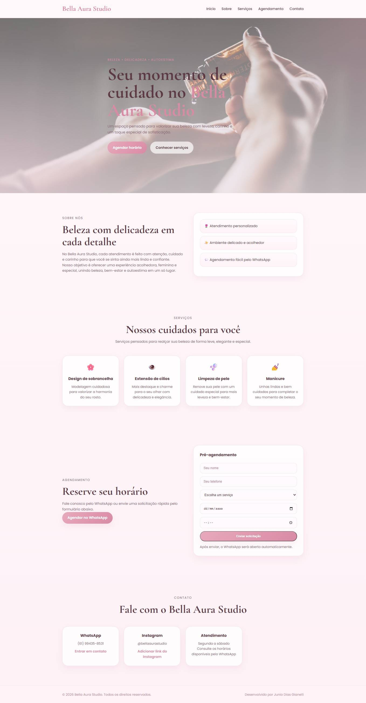

# Bella Aura Studio – Website

Este projeto é um site desenvolvido para o **Bella Aura Studio**, um estúdio de beleza especializado em cuidados estéticos como design de sobrancelha, extensão de cílios, limpeza de pele e manicure.

O objetivo do site é apresentar os serviços do estúdio de forma elegante e facilitar o **agendamento de clientes através do WhatsApp**.

---

## 🌐 Site Online

Acesse o site publicado:

https://juslli.github.io/bella-aura-studio

---

## 📸 Preview do Projeto

---

## ✨ Funcionalidades

O site possui:

* Página inicial com apresentação do estúdio
* Seção sobre o studio
* Apresentação dos serviços oferecidos
* Galeria de imagens
* Depoimentos de clientes
* Formulário de pré-agendamento
* Botão de contato direto no WhatsApp
* Área de contato
* Layout responsivo para celular e computador

---

## 🛠️ Tecnologias utilizadas

Este projeto foi desenvolvido utilizando:

* **HTML**
* **CSS**
* **JavaScript**

---

## 📱 Integração com WhatsApp

O site possui integração direta com o WhatsApp para facilitar o agendamento de horários e o c
